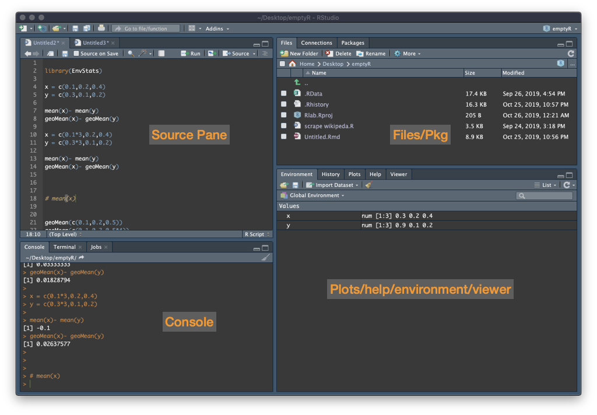

---
output:
  html_document:
    number_sections: true
    toc: true
    toc_float: 
      collapsed: false
editor_options:
  chunk_output_type: inline
---

```{r setup, include=FALSE}
knitr::opts_chunk$set(echo = TRUE)

```

```{css echo=FALSE}
.excc{
background-color: lightblue;
}
```


<br>
<font size="+3"><strong>Course 1 - Introduction to R</font></strong>

<!-- Course 1 - Introduction to R {.tabset}-->


# Install and navigate R Studio.

R is a free software environment for statistical analysis and data science. It is a collaborative effort started by Robert Gentleman and Ross Ihaka in New Zealand, but now made up of hundreds of people. R is made freely available by the Comprehensive R archive Network (CRAN), in the UK it can be downloaded through the University of Bristol *[here](https://www.stats.bris.ac.uk/R/)*.There are options of downloading R for Linux, Max and Windows.

Downloading R gives you the basic software environment, but an incredibly popular add-on called 'RStudio' is required to follow this course. You should download the free 'RStudio Desktop Open Source Licence' version for the laptop you will be attending the course with from *[RStudio.com](https://www.rstudio.com/products/rstudio/#Desktop)*. If you have time before the course, it would be hugely beneficial to get familiar with RStudio.


**Objectives:**

> Download R from <https://www.stats.bris.ac.uk/R/>.  
> Download RStudio from <https://www.rstudio.com/products/rstudio/#Desktop>.


If you found this guide useless. please follow this alternative guide *[here](https://www.dummies.com/education/math/statistics/download-r-rstudio/)* and let me know in the session that my guide sucks.

<br><br>


# Basics

R studio contains four panels: a script panel where you can save your code (we will introduce this later so to begin there will just be three panels), a console where you can enter and run your code and where the outputs are displayed, an 
environment which lists the objects you create, and another window which includes help, files and displays any plots you create.




Our course starts in the R console, which those of you who are familiar with R but not RStudio will recognise. We will enter commands as input into the console, and receive output from the console. We will start with some simple basic operations, for which R is clearly very excessive.

<br><br>

# Basic operations
Entering `1+1`, we get the output `[1] 2`. The output is `2`, but the `[1]` lets us know that the number 2 is the first number of output. If we had an output that was particularly large (e.g. 100 seperate numbers) then r may let us know that the first row displayed starts with the first value `[1]` and the second row starts with the `[x]`th value. 

```{r,echo=TRUE}

## add 1 to 1. 
1 + 1

## divide 12 by 4
12/4

## times 3 by 7
3*7

## 10 to the power 3
10^3

## root isn't a basic operation so we will look at later.
```
<br><br>

# Objects
R is object orientated, which bascially means when we work in R we are generally writing code to make changes to an object (e.g. a dataset), based on other objects. An object can take a number of forms (e.g. a number, a vector of numbers, a matrix, a data-frame). We can then use these objects going forward rather than the values directly. Operations can be applied to these objects, and objects can be over-written. If you understand how to manipulate objects you are most of the way there.

```{r,echo=TRUE}

# create an object x which is 3
x <-  3
# create an object y which is 5
y <-  5
# add x and y
x + y
# overwrite x so it now equals 4.
x <-  4
# add x and y again, now the result is 9, not 7.
x + y
# create another object z which is equal to x + y at this time. 
z <- x + y
z

```
<br><br>

# Manipulating Objects

We can overwrite our objects. But be careful, just because we overwrite something doesn't mean other objects created in the code before update.

```{r,echo=TRUE}
# create an object a which is 10.
a <- 10
a
# add one to a. A is now 11.
a <- a + 1 
a 

# create an object called b which is 5 more than a
b <- a - 5
a <- a - 5
a-b

```

# Seeing our Objects
Sometimes we have so many objects we can't see them in the environment.
```{r,echo=TRUE}
# prints the objects in the environment
ls()
```


```{r,echo=TRUE}
### Removing Objects
# sometimes we may want to remove an object.
rm(a)
# multiple objects at once
rm(x,y)
# remove all objects
rm(list=ls())
```

<br><br>

## *Exercises*

```{excc, class.source="excc"}
  1) Create an object d equal to 10. Divide d by 5. Multiply d by 8. Add 8 to d. what is d?  
  2) Create an object m equal to 7. Overwrite m with m = m times 10. Create an object p equal to 2. Overwrite p with p = p times 12. Create an object w equal to m divided by p. What values do m, p and w take? 
```

<details><summary>Show solution</summary><p>
```
  # create an object a which is 10.
d <- 10 
d <- d/5
d <- d*8
d <- d+8
d
m <- 7
m <- m*10 
p <- 2
p <- p*12
w <- m/p
```
</p></details>

<br><br>

# Evaluations
We can perform evaluations, which provide a true or false answer. For example the input `4>2` returns `FALSE`. 

It can be very useful in cases where an outcome is binary (e.g. an individual dies or remains alive). Or where we want to change a continuous variable to a binary.

```{r,echo=TRUE}

## simple evaluations
## 4 is greater than 2
4 > 2
## 4 is greater than 5
4 > 5
## 4 is equal to 3, note double == for an evaluation
4 == 3
## 4 is not equal to 3, note != is not equal to.
4 != 3
## the character x is equal to the character x.
"dog" == "dog"
"dog" == "cat"

## the output from an evaluation can be stored as an object, x. This object can be subject to operations & manipulations.
b <- 4<2
b
```
<br><br>


## *Exercises*

Use R to answer the following questions for you:  
```{excc, class.source="excc"}
1) Is 6.2 greater than 1.6^4?  
2) Is 7.5 equal to 137.25/18.?  
3) m = 84 / 106, q = 156/3, is m/q greater than, equal to or less than  0.0152
```

<details><summary>Show solution</summary><p>
```
6.2 > 1.6^4
7.5 == to 137.25/18  
m = 84 / 106 
q = 156/3 
m/q >=  0.0152
  
```
</p></details>


# Object classes and types
So far we have mostly been working with objects of a single numeric value. However, objects don't have to take a single value, for example an object could be a vector of the heights of each child in a group of children.

We have mostly been working with numeric values (vectors of one). As we have already seen, objects don't have to be numeric. To illustrate the different classes we are going to create some vectors of different classes which we will then join together later to make a dataframe.

# Object Classes
Different classes include: numeric, character, factor, logical, integer & complex (ignore). We can create a vector using the function c() which concatenates objects. We can type ?c() to ensure we understand what c() does. Typing ?function gives us the help file for any function.
```{r,echo=TRUE}

## numeric
height <- c(1.38,1.45,1.21,1.56)
height

## numeric
weight <- c(31,35,28,40)
weight
class(weight)

## character
first_name <- c("Alice","Bob","Harry","Jane")
first_name


## factor
sex <- factor(x = c("F","M","M","F"))
sex

## logical
tall <- height > 1.5
```
<br><br>

# Operations on different data structures
We can perform operations on the different objects with different structures, lengths, classes etc. It is important to know what can be done to objects.

```{r, echo=TRUE}
# Adding:
c(1,2,3) + 1
c(1,2,3) + c(1,2,3)


# multiplication
heightft <- height*3.28

# concatenating
c(height,weight)
# concatenating to string
c(height,weight,first_name)

```
<br><br>

## *Exercises*
```{excc, class.source="excc"}
1) Create a vector called 'odds' with the numbers 1,3,5,7,9. Show what class odds is. 

2) Evaluate which numbers in the odds vector are greater than 4. 

4. Create a vector called 'fail' containing 1,3,5,'seven',9.
5. Show what class fail is.

6. Create a vector that gives everyone's weight in pounds (2.2lbs to kg)
````

<details><summary>Show solution</summary><p>
```
  1. odds = c(1,3,5,7,9)
  2. class(odds)
  3. odds > 4
  4. fail = c(1,3,5,'seven',9)
  5. class(fail)
  6. lb_from_weight = weight * 2.2
     lb_from_weight
```
</p></details>

<br><br>


# Basic object Types

There are multiple types of object in R. We can store objects together in a data-frame. In our example data-frame each column is a variable (height, weight, first_name), and each row is an individual. 

Different object types include:

* Vector - single variable is a 1x1 vector. All elements are the same class.
* Matrix - all elements are the same class.  
* Dataframe - columns are vectors of the same class. Rows are lists.
* List - anything goes. We will ignore these for now.

```{r,echo=TRUE}

## data frame- columns are variables, rows are observations.
df <- data.frame(height,weight,first_name,sex)
df

## we can select a single variable within the dataframe using the dollar sign.
df$height

## We can add a new variable easily, in this case based on other variables within the dataframe.
df$bmi <- df$weight / df$height^2 
df

# We can also select row and columns using row/column numbers, e.g. row1
df[1,]
# column 3
df[,3]
# matrices can't have different classes, everything forced to character.
m.df <- as.matrix(df)
# therefore can't multiply
# m.df[,"height"]*100
```
<br><br>

# Subsetting
We can subset our data, to reduce it to those we are interested in. This is useful when cleaning our data, and when changing a continuous variable to a categorical.
```{r,echo=TRUE}

## Our data-frame contains the height, weight, first name and bmi of 4 individuals.
df

#To subset a data frame we can use square brackets i.e df[row,column]
#Selecting a column(s)
df$height
df[,"height"]
df[,1]
df[,1:3]
df[,c(1,3)]

#selecting a row(s)
df[1,]

#We might also want to select observations (rows) based on the characteristics of the data
#E.g. we might want to only look at the data for people who are taller than 1.75m

#create a logical variable called min_height which contains T/F for each individual being over 175cm.
min_height <- df$height >= 1.75
min_height

## Subset the data to include only those observations (rows) for which height > 175cm (using min_height).
df.at_least_175 <- df[min_height,]
df.at_least_175

#People smaller than 1.75m
## Subset the data to include only those who are not above min-height of 175cm.
smaller = df$height < 1.75
df[smaller,]
df[!min_height,]


```
Note that there are other more advanced methods, which uses pipes and require less code (these are covered in more advanced courses).
<br><br>

## *Exercises*
```{excc, class.source="excc"}
1. Select the 3rd row from the data frame

2. Select the weight variable from the data frame using your prefered method

3. Select alice's data from the data frame 

4. Subset the data frame to show just the data for the females

5. type df[,-1] what does this give
```

<details><summary>Show solution</summary><p>
```
  1. df[3,]
  2. df[,"weight"]
  3. df[df$first_name == "Alice",]
  4. df[df$sex == "F",]
  5. Prints all rows, except the first one
  
```
</p></details>


<br>

**** 
<br>

# Independent exercises
Exercises

**Exercise 1**

Calculate the following:

a) `5*10`
<br>
b) `20/3`
<br>

Calculate `x` where `a = 20`, `b = 9`, `c = 5`, `d = 1.2`.

c) $x = 4b + 7c + 3d$
<br>
d) $x = \frac{8b + 4c -12d}{a}$

<br><br>

**Exercise 2**

`x <- c(10,30,4,52,60,7,8,10,12,15,14,17,19,20,25,30)`

a) Which numbers in `x` are above 8
<br>
b) Which numbers are equal to 10.
<br>
c) Which numbers are below 8 or above 30.
<br>
d) Can you create a matrix with numbers and characters.
<br>

        names <- c("Anne","Tom","Jamie","Max","Claire")
        ages <- c(12,16,25,34,28)
        cbind(names,ages)

What happens if you try to use the ages?

<br>
e) Create a dataframe for five individuals (Andrew, Betty, Carl, Diane and Elisa) who are aged (62,80,24,40,56) and have gender (male, female, male, female, female). 

<br>
f) Use evaluations and subsetting to find the characteristics of the individual who can claim their free bus pass (age 65+).

<br>
g) Create a variable in the dataframe called life expectancy, set this to 83 for females and 80 for males.

<br>
h) Create another variable called lyr (life years remaining) which is the number of years to life expectancy for each individual

<br><br>


