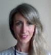

---
output:
  html_document:
    df_print: paged
    toc: false
    # toc_float: 
    #  collapsed: false
---

 

## Welcome
This series of short courses are designed to equip the participant with a basic set of tools to undertake research using R. The aim is to create a strong foundation on which participants can build skills and knowledge specific to their research and consultancy objectives. The course makes use of the authors' experiences (many of which were frustrating) of working with R for data-science and statistical analysis. However there are many other resources available, and we would particularly recommend the freely available content at *[R for Data Science](https://r4ds.had.co.nz/)* as a good place to recap the materials taught in this course. The hard copy of Hadley Wickham and Garrett Grolemund's book of the same name (and content) is available at *[Amazon.com](https://r4ds.had.co.nz/)*. Alternatively, a user guide is available on the CRAN R-Project website [here](https://cran.r-project.org/doc/manuals/r-release/R-intro.html), although the author finds this less easy to follow than Hadley Wickham's book described above. Further details of where to go to answer more specific questions are provided throughout the course.

__Requirements__: It is assumed that all participants on the course have their own laptop, and have previously used software such as Excel or SPSS. Some basic understanding of statistics and mathematics is required (e.g. mean, median, minimum, maximum).

  

## Who are we

All of the tutors on the course are PhD candidates in the Wellcome Trust Doctoral Training Centre for Public Health Economics and Decision Science at the School of Health and Related Research at the University of Sheffield.

<table border="0"; padding = 0px>
 <tr>
    <td width= 160px>   </td>
    <td><a href="https://www.linkedin.com/in/robert-smith-53b28438/" target="_blank">Robert Smith</a> joined ScHARR in 2016. His research focuses on the methods used to estimate the costs and benefits of public health interventions, with a specific interest in microsimulation modelling (done in R). He has become increasingly intersted in the use of R-Markdown and R-Shiny to make research more transparent and to aid decision makers. While doing his PhD, Robert has been involved in projects with the WHO and Parkrun.  </td>
 </tr>
 
 <tr>
    <td width= 160px>   </td>
    <td><a href="https://bitowaqr.github.io/about_me/" target="_blank">Paul Schneider</a> joined ScHARR in 2018. He is working on conceptual and methodological problems in valuing health outcomes in economic evaluations. A medical doctor and epidemiologist by training, he has used R in various research projects, ranging from the modeling costs of breast cancer, and value of information analyses, to the monitoring of influenza in real-time using online data. He is a keen advocate of open science practices.  </td>
 </tr>
 
 <tr>
    <td width= 160px>   </td>
    <td><a href="https://www.linkedin.com/in/sarah-elizabeth-bates-647ab9145/" target="_blank">Sarah Bates</a> joined ScHARR in 2016. Sarah is examining the role of psychological factors in weight trajectories during and after a weight management intervention, and how these factors can be used to inform weight trajectories in a health economic model of obesity. Sarah is using microsimulation modelling in R throughout her PhD.   </td>
 </tr>
 
 <tr>
    <td width= 160px>   </td>
    <td><a href="https://www.linkedin.com/in/tom-bayley-31ba8570/" target="_blank">Thomas Bayley</a> joined ScHARR in 2016. His research focuses on modelling the complex relationships that exist between Obesity, Depression and Socioeconomic status. He is interested in how data analysis and simulation modelling can be used to understand causal mechanisms in complex systems.  </td>
 </tr>
 
 <tr>
    <td width= 160px>   </td>
    <td><a href="https://www.linkedin.com/in/robert-smith-53b28438/" target="_blank">Naomi Gibbs</a> is working on a health economic model to inform alcohol pricing policy options in South Africa. She is working closely with local stakeholders to conceptualise and validate the model. Naomi will be using R to create and communicate her modelling work and hopes to enable greater engagement from policy makers through interactive dashboards.  </td>
 </tr>
 
 <tr>
    <td width= 160px>   </td>
    <td><a href="https://www.sheffield.ac.uk/scharr/staff-pgrs/studentprofiles/amychang" target="_blank">Amy Chang</a> joined ScHARR in 2018. Prior to joining ScHARR she worked at the Centre for Drug Evaluation (HTA body) in Taiwan. Her research interests lie in health economic modelling with an emphasis on evaluating health interventions and better understanding the effect of intervention timing using evidence generated from real-world data. Amy has previously used R for, among other things, survival analysis and large scale data scraping.
 </tr>
 
</table>

  

## Our series of Short Courses in R.

Below is a list of our planned short courses in R. 

 

### <a href="getting_started.html">Course 1 - Intro to R</a>  

By the end of the 1 day short course, the attendee should be able to:

* Install and navigate R Studio. 
* Set the working directory.
* Understand the types of objects and basic operations in R.
* Read in data from csv and excel files.
* Summarise data. 
* Know where to find further information.

  

****

